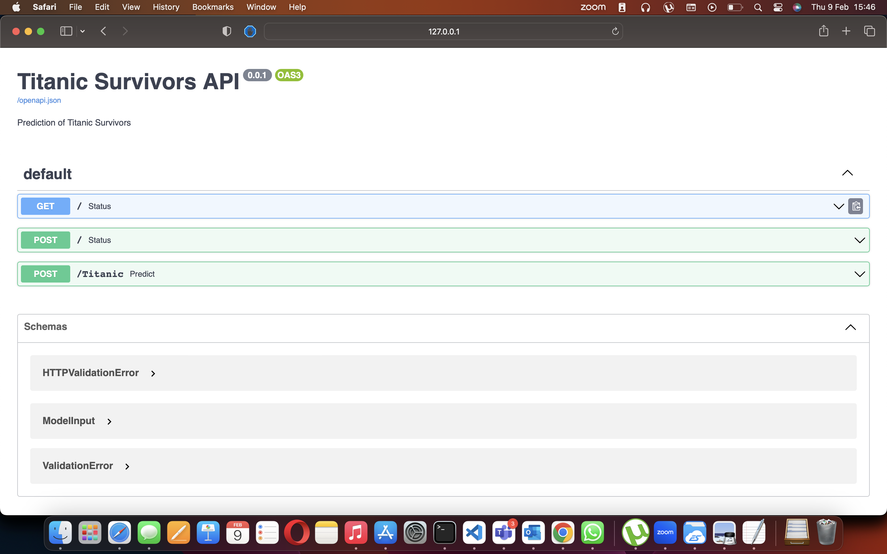

# Titanic Survival API
This is a simple API built using FastAPI to embed a Machine Learning model that predicts Titanic survivors.
This work was done by [Gyimah](https://github.com/Gyimah3) and I helped to debug some parts.

Do not hesitate to reach him out.

## Setup
Please follow the instructions to setup this project on your local machine.

You need to have [`Python 3`](https://www.python.org/) on your system (**a Python version lower than 3.10**). Then you can clone this repo and being at the repo's `root :: repository_name> ...`  follow the steps below:

- Windows:
        
        python -m venv venv; venv\Scripts\activate; python -m pip install -q --upgrade pip; python -m pip install -qr requirements.txt  

- Linux & MacOs:
        
        python3 -m venv venv; source venv/bin/activate; python -m pip install -q --upgrade pip; python -m pip install -qr requirements.txt  

## Execution
To run the project, please execute one of the following commands having the **venv** activated.

- FastAPI
    
    - python's command

            python src/main.py 
    
    - uvicorn's command

            uvicorn scr.main:app 

    Open the api in the browser :
        
        http://127.0.0.1:8000/

    Open the api's documentation in the browser :
        
        http://127.0.0.1:8000/docs

## Screenshots
This is a vies of the API's docs page
